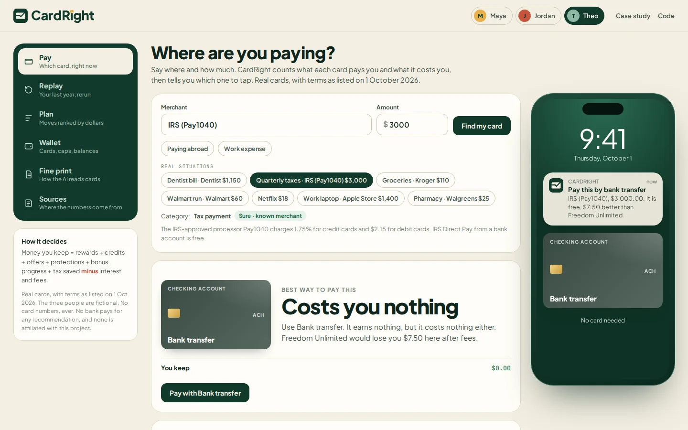
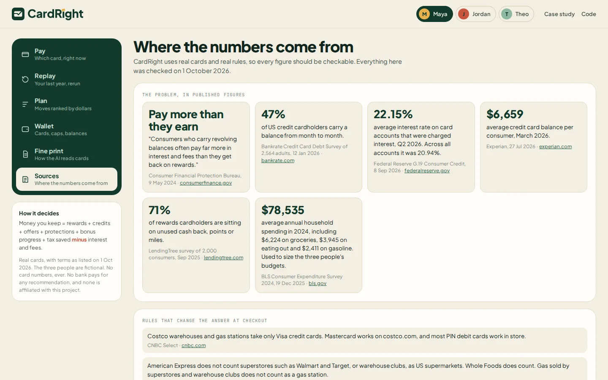

<p align="center"></p>

<p align="center"><b>The card that pays you most is not always the one that leaves you the most.</b></p>
<p align="center"><a href="https://murtuzabuilds.github.io/cardright/"><b>Live app</b></a> · <a href="https://murtuzabuilds.github.io/cardright/case-study.html"><b>Case study</b></a></p>


CardRight is a concept product I designed and built. It tells you which card to use for every purchase by counting what your cards cost you, not just what they pay you. It runs on real cards and real store rules, replays a year of spending, shows where money leaked, and ranks the moves worth making.

## Why I built it

People carry several cards, each with its own bonus categories, caps, activations, fees and protections, so most of us pick a favorite and use it for everything. Apps like CardPointers, MaxRewards and Kudos help by telling you which card earns the most points at a store.

That's the wrong question for a lot of people:

- **47%** of US cardholders carry a balance month to month ([Bankrate, Jan 2026](https://www.bankrate.com/credit-cards/news/credit-card-debt-report/)).
- The average rate on card accounts charged interest is **22.15%** ([Federal Reserve G.19, Q2 2026](https://www.federalreserve.gov/releases/g19/current/)).
- The CFPB puts it plainly: "Consumers who carry revolving balances often pay far more in interest and fees than they get back on rewards" ([CFPB, May 2024](https://www.consumerfinance.gov/archive/newsroom/cfpb-report-highlights-consumer-frustrations-with-credit-card-rewards-programs/)).

A 5% card at 26% APR loses money on every purchase. Rewards-first math misses that, along with foreign fees, tax effects and the protections a card adds.

## The idea

Every way to pay is scored on one number:

> **Money kept** = rewards + statement credits + card offers + protections + sign-up bonus progress + tax saved, **minus** interest, foreign fees and processing fees

Every term is shown, and estimates are labelled as estimates.

## What makes it different

1. **Net value, not points.** If you carry a balance, it steers new spending away from that card.
2. **The whole wallet, across the month.** It tracks caps, quarterly activations, sign-up deadlines and how much of each card's limit you're using.
3. **Tax-aware.** It covers HSA cards for medical bills, business cards for work spending, and the processing fee on paying taxes by card.
4. **No paid placement.** The "next card" check runs on your real spending and often says no.
5. **No card numbers.** It only needs to know which cards you hold.

## Real cards, real rules

The demo uses 16 real US cards with terms as publicly listed on 1 October 2026, including American Express Gold, Chase Sapphire Preferred, Chase Freedom Flex, Citi Double Cash, Discover it Cash Back, Wells Fargo Active Cash, Blue Cash Preferred, Capital One Savor and Apple Card. Each card carries the date it was checked and the pages it was checked against, and the app has a Sources view listing all of them.

The rules that change the answer at a real checkout are modelled too:

- Costco warehouses take only Visa credit cards.
- Walmart, Target and warehouse clubs don't count as grocery stores for grocery bonuses.
- Walmart doesn't take Apple Pay, so Apple Card earns its 1% physical-card rate there.
- Paying federal taxes by card costs 1.75% through an IRS-approved processor.
- Rotating 5% categories on Freedom Flex and Discover only pay in quarters you activate.

The three people and their spending are fictional. Their budgets are sized from the BLS Consumer Expenditure Survey.

## What's in the app

| | |
|---|---|
| **Pay**: at Costco, three of Maya's four cards are refused, and the app says why | **Replay**: a year rerun, with losses split by cause |
|  |  |
| **Interest counted**: the 5% card loses money once the carried balance is included | **Tax-aware**: the HSA beats every rewards card for a dentist bill |
|  |  |
| **Taxes**: a free bank transfer beats paying the IRS by card for points | **Plan**: moves ranked by dollars, each with its math |
|  |  |
| **Wallet**: real cards, caps, credits and bonus progress | **Sources**: every figure and card term, linked |
|  |  |

## Results

One year of synthetic spending on real cards. Run `npm run eval` to reproduce.

| Person | Spent | Actually kept | Could keep | Left on the table | Biggest cause |
|---|---|---|---|---|---|
| Maya, pays in full, travels | $24,393 | $911 | $1,076 | $166 | Wrong card for the purchase |
| Jordan, carries a balance | $13,951 | **-$702** | $327 | **$1,029** | Interest on new spending |
| Theo, freelancer with an HSA | $39,624 | $469 | $1,216 | $747 | Tax not saved |

Maya is the honest counter-example: her Gold card is a good default, so there is little to fix. The product matters most for Jordan.

The two AI-shaped steps, tested on examples they were never tuned on:

| Step | Tuned set | Held-out set | Held-out misses flagged | Misses not flagged |
|---|---|---|---|---|
| Fine print reader (fields) | 100% | 91% | 2 | 1 |
| Merchant categories | 100% | 56% | 8 | 0 |

The merchant step is weak on unfamiliar names. But every miss came back marked "not sure", so the app asks instead of guessing.

## What is assumed

- A carried balance costs about three months of interest on each new purchase.
- An extended warranty is valued at about 2% of the price, and phone protection at about $4 a month.
- Points are valued at 1 cent as cash, or at NerdWallet's transfer estimates for travel (29 Sep 2026).
- Merchant categories are what card networks typically assign, and can vary by location.
- Each person has one interest rate inside the card's published range.

## The code

Plain JavaScript, no dependencies, all in `src/` and tested.

| File | What it does |
|---|---|
| `cards.js` | Sixteen real cards with their terms, check date and sources, plus the bank-transfer option |
| `people.js` | Three fictional people holding real cards, and a deterministic year of spending for each |
| `merchants.js` | Real merchants, which networks they accept and how they are categorised, plus a classifier that reports confidence |
| `optimize.js` | The net value engine: one purchase in, every way to pay scored with each term shown |
| `replay.js` | Reruns a year three ways (actual, smart, best) to split losses by cause |
| `plan.js` | Ranked moves: routing, interest, balance transfer, activations, HSA, fee checks, next card |
| `terms.js` | Reads card fine print into rules and flags what it can't read |
| `evals.js` | Tuned and held-out sets for the two AI steps |
| `sources.js` | Every real-world figure used, with its source and date |

```bash
npm test       # 19 tests
npm run eval   # the results tables
npx serve .    # open the app
```

In this prototype the fine-print reader and the merchant classifier are transparent rule-based stand-ins, so everything runs offline. In a real product a language model would fill the same output shapes, a person would approve each card's rules, and the decision would stay with the fixed, tested math.

CardRight is an independent concept project. It is not affiliated with, sponsored by or endorsed by any bank, card issuer or merchant named. Card and merchant names are trademarks of their owners. Card terms change often, so check with the issuer before deciding. Not financial advice.

Designed and built by Murtuza. MIT licence.
