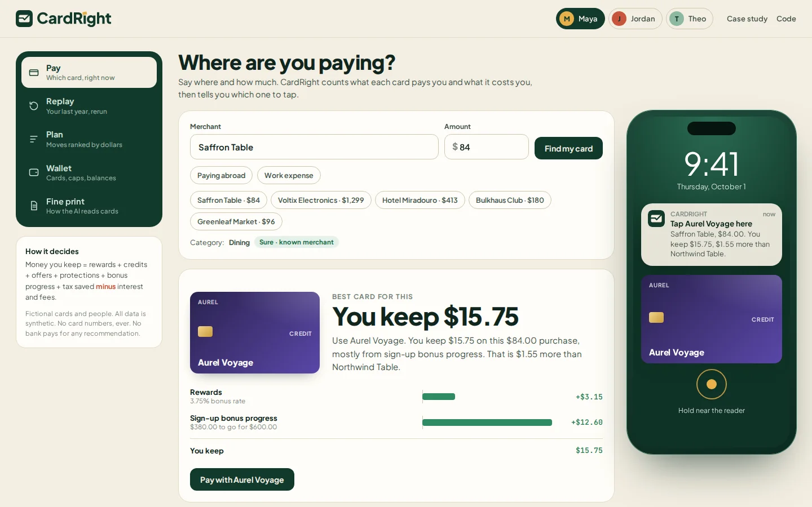
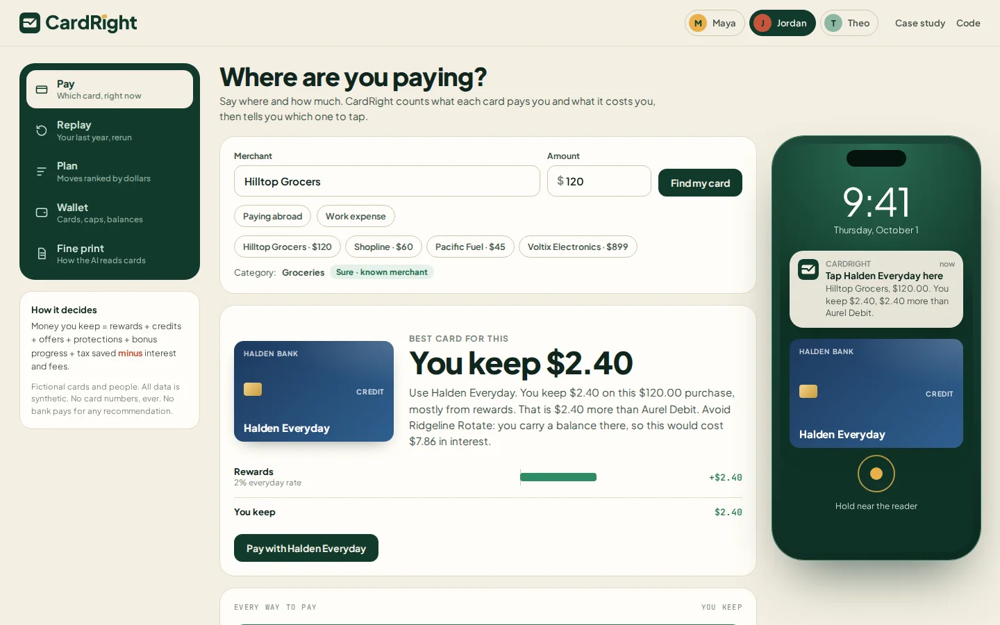
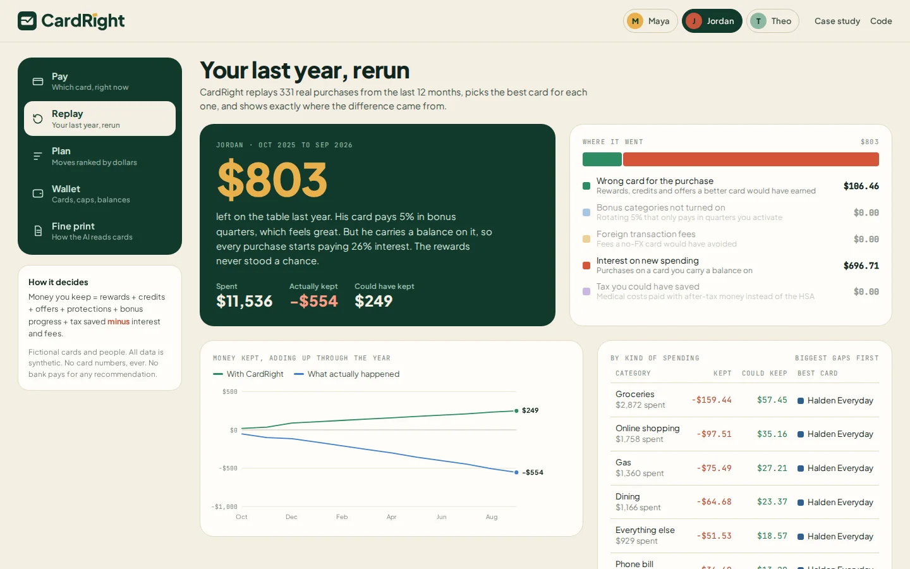
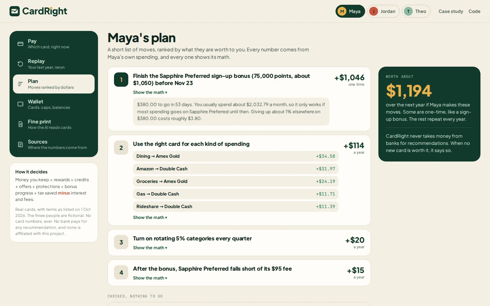
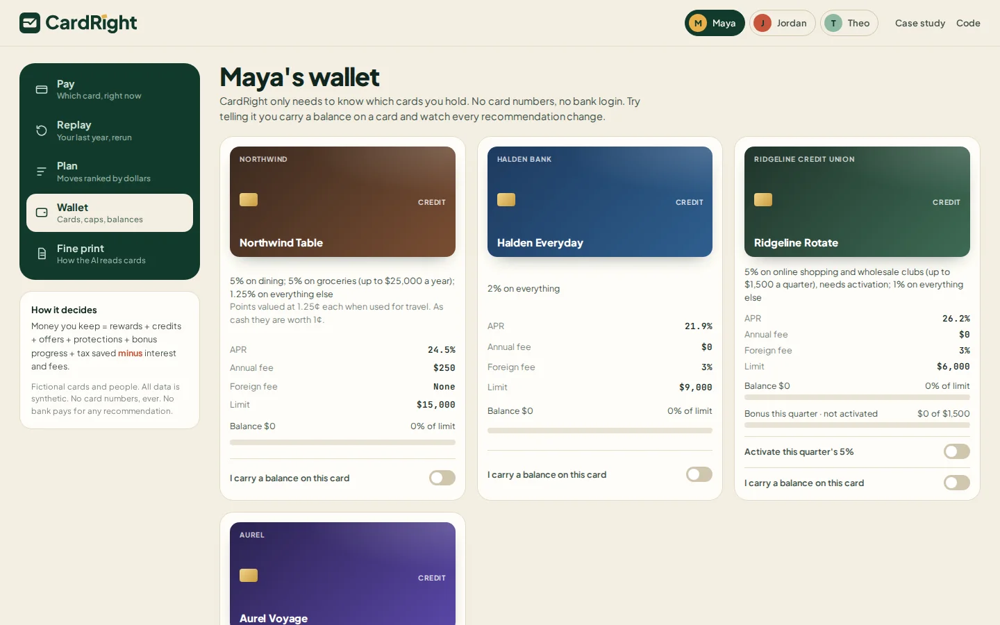
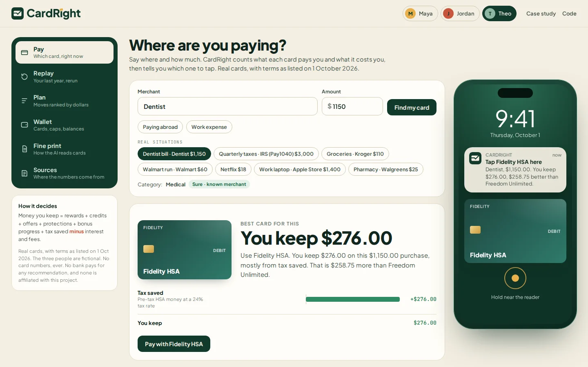
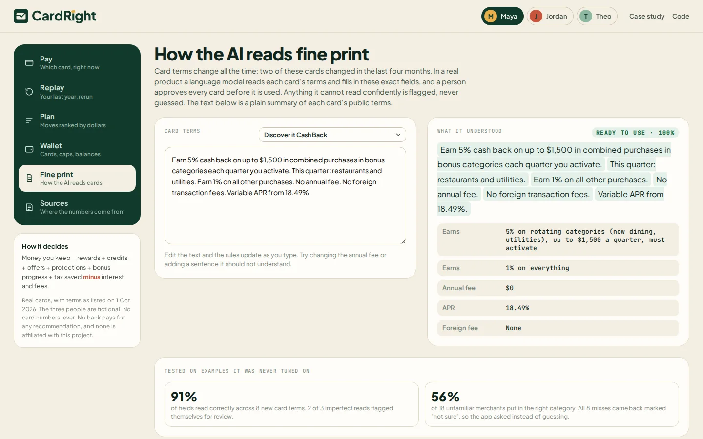

<p align="center"></p>

<p align="center"><b>The card that pays you most is not always the one that leaves you the most.</b></p>
<p align="center"><a href="https://murtuzabuilds.github.io/cardright/"><b>Live app</b></a> · <a href="https://murtuzabuilds.github.io/cardright/case-study.html"><b>Case study</b></a></p>



CardRight is a concept product I designed and built. It tells you which card to use for every purchase by counting what your cards cost you, not just what they pay you. It replays your last year of spending, shows where money leaked, and ranks the moves worth making.

## Why I built it

People carry several cards, each with its own bonus categories, caps, activations, fees and protections, so most of us pick a favorite and use it for everything. Apps like CardPointers, MaxRewards and Kudos help by telling you which card earns the most points at a store.

That's the right question for some people and the wrong one for anyone who carries a balance. A 5% card at 26% APR loses money on every purchase. Rewards-first math misses that, along with foreign fees, tax effects and the protections a card adds.

## The idea

Every way to pay is scored on one number:

> **Money kept** = rewards + statement credits + card offers + protections + sign-up bonus progress + tax saved, **minus** interest, foreign fees and processing fees

Every term is shown, and estimates are labelled as estimates.

## What makes it different

1. **Net value, not points.** If you carry a balance, it steers new spending away from that card.
2. **The whole wallet, across the month.** It tracks caps, quarterly activations, sign-up deadlines and how much of each card's limit you're using.
3. **Tax-aware.** It covers HSA cards for medical costs, business cards for work spending, and the processing fee on paying taxes by card.
4. **No paid placement.** The "next card" check runs on your real spending and often says no.
5. **No card numbers.** It only needs to know which cards you hold.

## What's in the app

| | |
|---|---|
| **Pay**: which card to tap, with the full breakdown and the notification you'd see at checkout | **Replay**: your last year rerun, with losses split by cause |
|  |  |
| **Plan**: moves ranked by dollars, each with its math | **Wallet**: caps, bonus progress, balances. Flip "I carry a balance" and everything updates |
|  |  |
| **Tax-aware**: the HSA beats every rewards card for a dentist bill | **Fine print**: watch the AI turn card terms into rules |
|  |  |

## Results

One year of synthetic spending for three made-up people. Run `npm run eval` to reproduce.

| Person | Spent | Actually kept | Could keep | Left on the table | Biggest cause |
|---|---|---|---|---|---|
| Maya, pays in full, travels | $20,374 | $915 | $1,109 | $194 | Wrong card for the purchase |
| Jordan, carries a balance | $11,536 | **-$554** | $249 | **$803** | Interest on new spending |
| Theo, freelancer with an HSA | $35,814 | $536 | $1,022 | $487 | Tax not saved |

The two AI-shaped steps, tested on examples they were never tuned on:

| Step | Tuned set | Held-out set | Held-out misses flagged | Misses not flagged |
|---|---|---|---|---|
| Fine print reader (fields) | 100% | 88% | 3 | 1 |
| Merchant categories | 100% | 56% | 8 | 0 |

The merchant step is weak on unfamiliar names. But every miss came back marked "not sure", so the app asks instead of guessing.

## The code

Plain JavaScript, no dependencies, all in `src/` and tested.

| File | What it does |
|---|---|
| `cards.js` | Twelve fictional cards with realistic structures, and the bank-transfer option |
| `people.js` | Three wallets and a deterministic year of spending for each |
| `merchants.js` | Known merchants and their category quirks, plus a classifier that reports confidence |
| `optimize.js` | The net value engine: one purchase in, every way to pay scored with each term shown |
| `replay.js` | Reruns a year three ways (actual, smart, best) to split losses by cause |
| `plan.js` | Ranked moves: routing, interest, balance transfer, activations, HSA, fee checks, next card |
| `terms.js` | Reads card fine print into rules and flags what it can't read |
| `evals.js` | Tuned and held-out sets for the two AI steps |

```bash
npm test       # 14 tests
npm run eval   # the results tables
npx serve .    # open the app
```

In this prototype the fine-print reader and the merchant classifier are transparent rule-based stand-ins, so everything runs offline. In a real product a language model would fill the same output shapes, a person would approve each card's rules, and the decision would stay with the fixed, tested math.

All cards, issuers, people and transactions are fictional. Not financial advice.

Designed and built by Murtuza. MIT licence.
