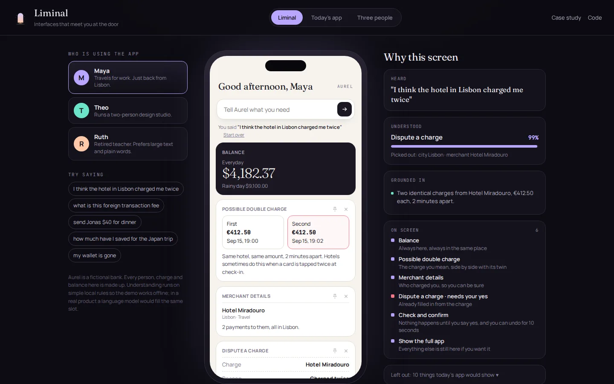
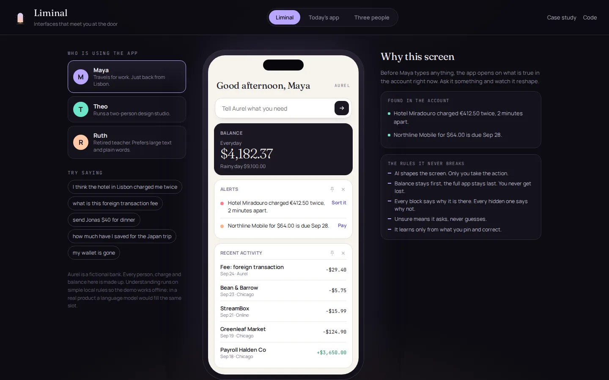
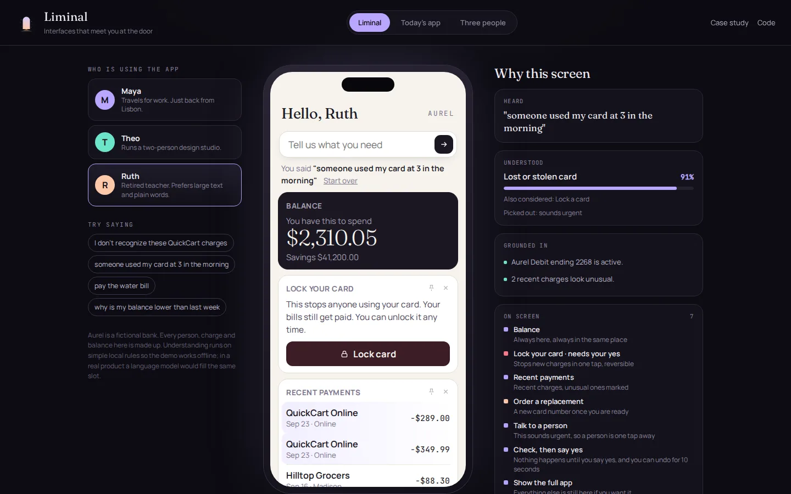
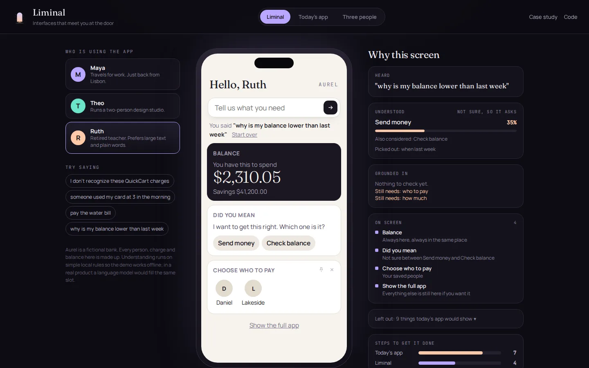
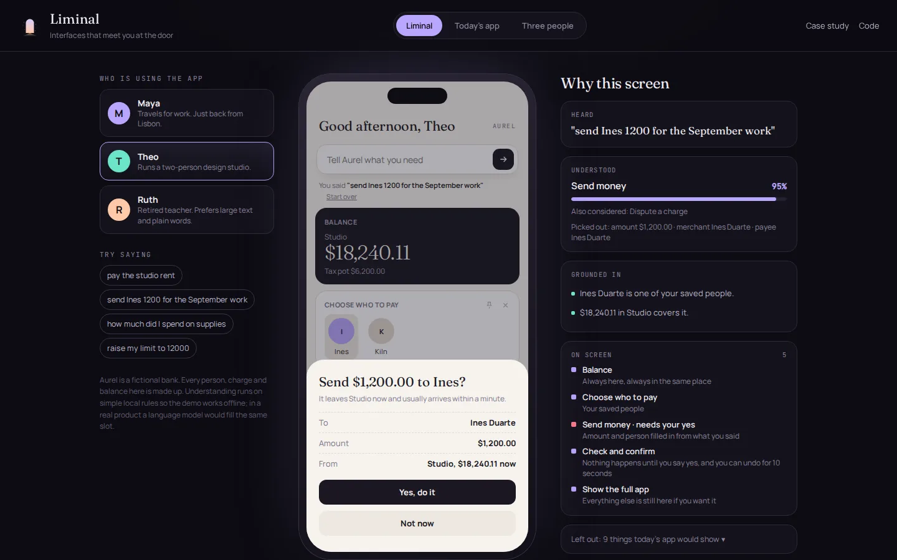
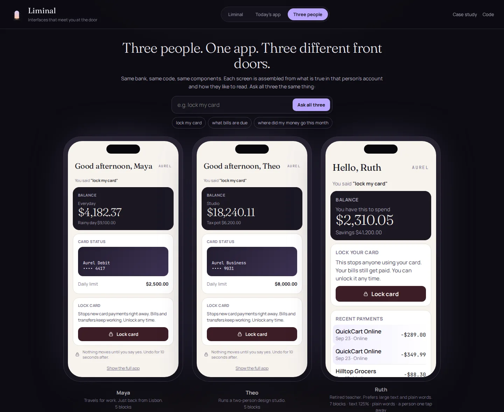
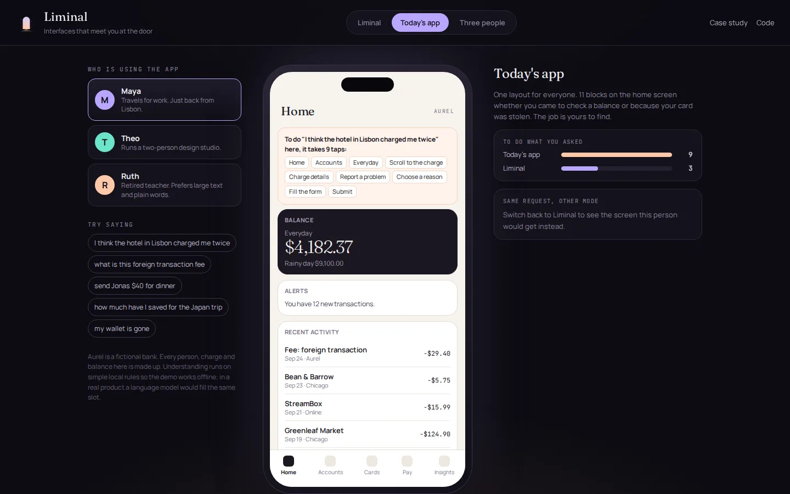

<p align="center"></p>

<h1 align="center">Liminal</h1>
<p align="center">A bank app that meets you at the door.</p>
<p align="center"><a href="https://murtuzabuilds.github.io/liminal/"><b>Live demo</b></a> · <a href="https://murtuzabuilds.github.io/liminal/case-study.html"><b>Case study</b></a></p>



Liminal is a concept product I designed and built. It reshapes a banking app around what each person came to do, shows why every piece is on the screen, and never moves money without a yes.

## Why I built it

Banking apps are organised like the bank: Accounts, Cards, Pay, Insights. People don't open the app thinking in tabs. They open it because something happened. The hotel charged them twice. They can't find their card. There's a fee they don't understand.

Each of those moments is a hunt through menus. In the conventional app modelled here, disputing a charge takes 9 taps across five screens. Liminal does it in 3, starting from one sentence.

Reshaping an interface is the easy part. Doing it in a bank, where a moving layout loses people and a wrong action loses money, is the real product problem. So most of the work here went into the rules that make it safe to trust.

## Five rules it never breaks

1. **The model shapes the layout. Only you take the action.** Anything that moves money, locks a card or changes a limit is a prepared form, then a confirm step, then a 10 second undo.
2. **Anchors never move.** Balance is always first and "Show the full app" is always last.
3. **Every block says why it is there, and every hidden one says why not.** The reasoning panel is the trust layer, not a debug view.
4. **Unsure means it asks.** Low confidence produces a short "did you mean" with every action removed.
5. **It learns only from what you tell it.** Pins, hides and corrections. Nothing from hesitation or gaze.

## What's in the demo

| | |
|---|---|
| **Opening screen**: before anyone types, it surfaces what's true in the account | **Ruth**: large text, plain words, lock first, a person one tap away |
|  |  |
| **Not sure**: it asks instead of guessing, and remembers the answer | **Confirm**: a clear summary, a yes, and an undo |
|  |  |
| **Three people**: ask all three the same thing | **Today's app**: the control, with the tap path spelled out |
|  |  |

## Results

Two sets of requests: one I tuned the rules on, and a held-out set written after the rules were frozen. Run `npm run eval` to reproduce.

| | Tuned (30) | Held-out (15) |
|---|---|---|
| Understood correctly | 100% | 47% |
| Steps to finish, static app | 6.1 | 6.2 |
| Steps to finish, Liminal | 2.4 | 2.7 |
| Misses that asked first | 0 | 6 |
| Misses shown with confidence | 0 | 2 |
| Actions that waited for a yes | all | all |

The held-out accuracy is low, and I left it that way: hand-written rules overfit. That is why understanding is a swappable slot. What the product owns is behaviour when understanding fails, and there 6 of 8 misses turned into a question, and the other 2 still couldn't move money without a yes.

## The code

Plain JavaScript, no dependencies. The engine lives in `src/` and is tested.

| File | What it does |
|---|---|
| `data.js` | Aurel, a fictional bank, and three made-up customers |
| `components.js` | The kit of about twenty blocks, each with a risk level, plus the static app baseline |
| `understand.js` | Intent, confidence and details from a sentence. A rule-based stand-in for a model, same output shape |
| `ground.js` | Finds evidence in the account: double charges, 3am purchases at new stores, bills due, balances |
| `compose.js` | Builds the screen: blocks with reasons, hidden blocks with reasons, anchors, confirm steps |
| `prefs.js` | Pins, hides and corrections |
| `evals.js`, `measure.js` | The two request sets and the comparison with the static app |

```bash
npm test       # 13 tests
npm run eval   # the results table
npx serve .    # open the demo
```

All people, merchants, charges and balances are synthetic.

Designed and built by Murtuza. MIT licence.
